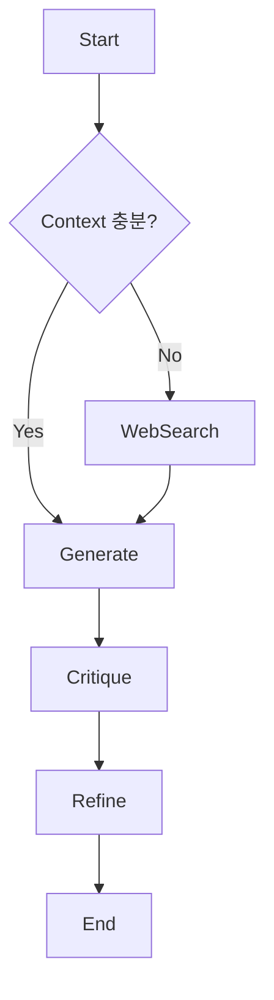

# Hypothesis Maker Reinforcement Plan 🧠

현재는 기본적인 `Generate` 노드 하나로 구성되어 있습니다. 향후 다음과 같이 지능을 확장할 계획입니다.

## 1. Debate Architecture (토론 구조 도입)
- **Proposer**: 과감하고 창의적인 가설 제시
- **Critic**: 제시된 가설의 논리적 허점과 물리적 실현 가능성 비판
- **Synthesizer**: 양측의 의견을 종합하여 최종 가설 도출

## 2. Research Node (연구 노드)
- RAG 검색 결과가 부실할 경우 (유사도 낮음), 자동으로 외부 지식(Web Search)을 검색하거나 매뉴얼을 조회하는 노드 추가.

## 3. Reflection Loop (자가 회고)
- 가설을 내보내기 전에 "이 가설이 정말 검증 가능한가?"를 스스로 평가하고, 부족하면 다시 생성하는 내부 루프 구현.

## Proposed Graph Structure

