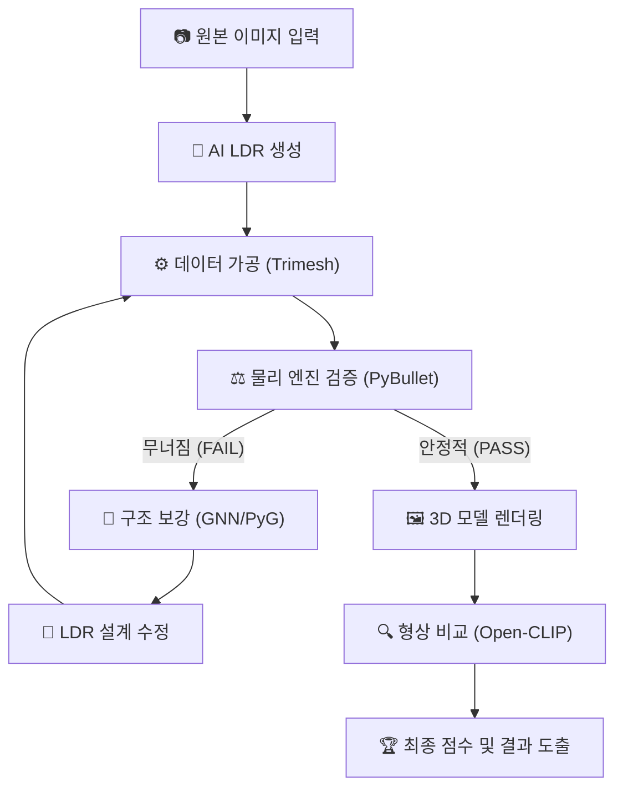

레고 AI 물리 검증 및 최적화 무료 스택 설계안

이 문서는 비용이 전혀 들지 않는(Zero-Cost) 오픈 소스 도구들만을 활용하여, 레고 모델의 물리적 검증, 구조적 보강, 그리고 이미지 유사도 판별을 수행하는 최적의 기술 스택을 제안합니다.

---

1. 과제별 최적 도구 선정 (All Free)

| 과제 | 추천 도구 | 역할 및 장점 |
| :--- | :--- | :--- |
| 물리 검증 | PyBullet | - NASA/Google 등에서 검증된 정밀 물리 엔진 - 브릭 간 고정 결합(Fixed Joint) 계산에 최적화 - 낙하 테스트 및 무게 중심 분석 수행 |
| 구조 보강 | GNN / Custom Logic | - PyTorch Geometric: 브릭 간 연결 관계를 그래프로 분석 - Custom Logic: 무너진 좌표 주변에 보강 브릭을 자동 배치하는 알고리즘 짜기 |
| 형상 비교 | Open-CLIP / OpenCV | - Open-CLIP: 사진과 3D 렌더링 결과물의 직관적 유사도 점수 산출 - OpenCV: 사진의 윤곽선(Edge)과 모델의 실루엣 일치율(IoU) 계산 |
| 데이터 가공 | Trimesh | - LDraw(.dat) 파일을 읽어 물리 엔진용 매쉬 데이터로 변환 - 부품별 부피 및 무게 중심 사전 계산 |

---

2. 도구별 상세 분석 및 장점

① 물리 검증: PyBullet
- 장점: 단순한 충돌 감지를 넘어 '시간의 흐름'에 따른 물리적 안정성을 테스트할 수 있습니다.
- 효율성: Python 라이브러리가 매우 성숙하여, 기존 LDR 파서와 연동하기가 가장 쉽습니다.
- 호환성: 매쉬 데이터(OBJ, STL 등)와 바로 연동되며, 수천 개의 브릭을 동시에 시뮬레이션하기에 적합합니다.

② 구조 보강: GNN (PyTorch Geometric 활용)
- 관계: GNN(기술)을 구현하기 위해 PyTorch Geometric(라이브러리)을 확장팩처럼 사용합니다.
- 분석: 레고를 브릭(점)과 결합(선)으로 이루어진 '그래프 데이터'로 변환하여 구조적 취약점을 지능적으로 파악합니다.
- 수정 방식: PyBullet에서 얻은 파손 데이터를 기반으로, 구조적 강성을 높일 수 있는 최적의 부품과 위치를 예측하여 설계를 수정합니다.

③ 이미지 유사도: Open-CLIP
- 장점: OpenAI CLIP의 오픈 소스 버전으로, 로컬(RTX 3060 등)에서 무제한 무료 전용이 가능합니다.
- 활용: 물리 검증을 통과한 최종 모델이 원본 사진의 형상(Silhouette) 및 특징과 얼마나 일치하는지 시각적 점수를 산출합니다.

---

3. 통합 워크플로우 (Data Pipeline)

모든 도구는 Python을 기반으로 하며 다음과 같은 흐름으로 연동됩니다.

1.  [Preprocessing] (Trimesh): LDR 파일을 3D 매쉬로 변환하고 부품별 무게/부피 등 물리 파라미터 산출
2.  [Physics Test] (PyBullet): 가공된 데이터를 엔진에 로드하여 중력 시뮬레이션 수행 (무너질 경우 파손 좌표 추출)
3.  [Optimization Loop] (GNN/PyG): 
    - PyBullet의 파손 데이터를 입력받아 GNN 모델이 보강 구조 결정
    - 수정된 LDR을 생성하여 다시 1~2단계 재검토 (안정화될 때까지 무한 루프)
4.  [Final Visual Check] (Open-CLIP): 물리적으로 안정된 최종 모델을 렌더링하여 원본 이미지와 유사도 비교 (최종 점수 확정)

---

4. 시각화 순서도 (Integrated Flowchart)

---

5. 최종 결론

| 구분 | 상용 솔루션 (유료) | 제안 스택 (무료) |
| :--- | :--- | :--- |
| 비용 | 월 수십~수백만 원 (API 비용) | 0원 (오픈 소스) |
| 자유도 | 제공되는 기능만 사용 가능 | 코드 수정을 통해 레고 특화 커스텀 가능 |
| 정확도 | 범용적인 시각 지능 우수 | 레고 물리 법칙에 기반하여 더 정밀함 |

TIP:
멘토님께 보여드릴 때: "PyBullet을 중심으로 물리적 실현 가능성을 먼저 검증한 뒤, 오픈 소스 시각 모델인 Open-CLIP을 활용해 사진과의 형태적 유사도를 수치화하는 하이브리드 검증 시스템입니다."라고 설명하시면 전문성이 돋보일 것입니다.
