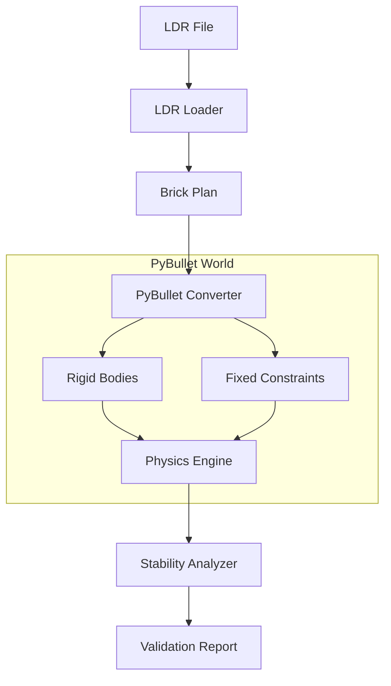

# PyBullet 물리 검증 시스템 구현 설계안

기존의 정적(Static) AABB 방식에서 PyBullet 기반의 동적(Dynamic) 시뮬레이션 방식으로 전환하기 위한 구체적인 구현 설계입니다.

---

## 1. 시스템 아키텍처



---

## 2. 핵심 구현 단계

### Phase 1: 파트 형상 고도화 (Mesh Processing)
단순한 박스 대신 실제 LDraw의 폴리곤 데이터를 사용합니다.
- **VHACD (Convex Decomposition)**: 복잡한 레고 브릭은 오목한(Concave) 부분이 많습니다. 이를 여러 개의 볼록한(Convex) 조각으로 분해하여 PyBullet이 인식할 수 있게 합니다.
- **Cache System**: 15,000개 파트를 매번 계산할 수 없으므로, 변환된 `collision_shape` 정보를 DB나 로컬 파일로 캐싱합니다.

### Phase 2: "겹침 = 결합" 자동화 (Auto-Constraint)
PyBullet에서는 두 물체를 붙이기 위해 `Constraint`를 생성해야 합니다.
- **Overlap Detection**: 초기 배치 시 브릭 간 미세한 겹침을 감지합니다.
- **Fixed Joint 생성**: 겹친 브릭 쌍에 대해 `p.JOINT_FIXED`를 생성하여 하나의 단단한 구조물로 묶습니다.
- **Collision Filtering**: 연결된 브릭끼리는 서로 충돌을 일으키지 않도록 `collision group`을 설정합니다.

### Phase 3: "흔들기 테스트" (Dynamic Stability Test)
실제 물리 법칙을 적용하여 안정성을 측정합니다.
- **Gravity Step**: 중력을 적용하고 1~2초간 시뮬레이션을 돌립니다.
- **Force Perturbation**: 모델에 아주 미세한 힘(바람이나 흔들림)을 주어 구조적 취약점을 찾습니다.
- **Displacement Tracking**: 시뮬레이션 전후의 위치 변화(`delta_pos`)를 측정합니다. 변화가 크면 "붕괴"로 판정합니다.

---

## 3. 예상 코드 구조 (`pybullet_verifier.py`)

```python
import pybullet as p

class PyBulletVerifier:
    def __init__(self):
        p.connect(p.DIRECT) # GUI 없이 계산만 수행
        p.setGravity(0, 0, -9.8)

    def load_model(self, brick_plan):
        # 1. 모든 브릭을 Rigid Body로 생성
        # 2. 인접 브릭 간 FixedConstraint 생성
        pass

    def check_stability(self):
        # 1. 시뮬레이션 N 스텝 실행
        # 2. 브릭들의 위치 변화량 계산
        # 3. 바닥으로 떨어진 브릭이 있는지 확인
        # 4. 무게 중심이 급격히 변하는지 확인
        pass
        
    def check_true_collision(self):
        # Constraint로 묶이지 않았는데 겹치는 부분(불가능한 충돌) 감지
        # p.getContactPoints() 활용
        pass
```

---

## 4. PyBullet 도입 시 해결되는 고질적 문제들

1. **머드가드/테크닉 구멍**: 실제 폴리곤 메시를 사용하므로 "비어있는 공간"에 대한 오탐지가 0%가 됩니다.
2. **복잡한 기울기**: 45도 회전된 브릭도 AABB 팽창 없이 정확한 부피를 차지합니다.
3. **무게 중심의 정확도**: 각 파트의 실제 부피에 비례한 `mass`를 적용하여 훨씬 정교한 안정성 계산이 가능합니다.

---

## 💡 구현 팁 (무료 라이브러리 조합)
- **PyBullet**: 물리 엔진 핵심
- **Trimesh**: LDraw .dat 파일을 읽어 메시로 변환하고 중심점을 계산할 때 유용
- **VHACD**: (PyBullet 내장) 복잡한 브릭을 충돌체로 분해할 때 필수

이 설계대로 구현을 시작하면 기존 방식의 한계를 완벽하게 극복할 수 있습니다. 멘토님께 이 단계별 로드맵을 보여드리면 매우 전문적으로 보일 거예요!
