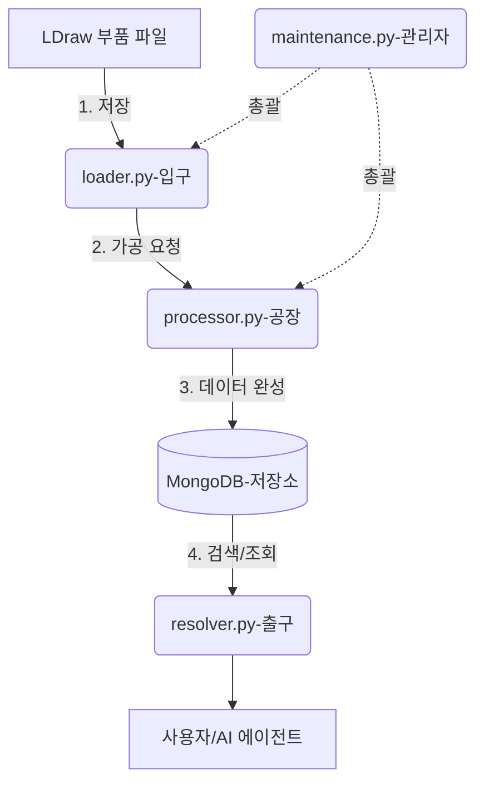

# VectorDB Module README

LDraw 부품 데이터의 관리, 연산 및 검색을 담당하는 핵심 모듈입니다.

## 🧱 데이터가 처리되는 순서 (Pipeline)
부품 데이터가 시스템에 들어와서 사용자에게 검색되기까지의 과정을 **'입구-공장-출구'** 모델로 설명합니다.

### 데이터 흐름 4단계
1.  **[데이터 확보]** 최신 부품 파일을 공식 사이트에서 내려받습니다. (`maintenance.py`)
2.  **[입구: DB 저장]** 파일을 읽어서 이름, 카테고리 같은 기초 정보를 DB에 차곡차곡 쌓습니다. (`loader.py`)
3.  **[공장: 정밀 연산]** 저장된 데이터를 바탕으로 부품의 진짜 크기(BBox)를 계산하고, AI가 검색할 수 있도록 벡터로 변환합니다. (`processor.py`)
4.  **[출구: 검색 활용]** 완성된 데이터를 사용자가 파일명이나 느낌(벡터)으로 찾을 수 있게 내보내 줍니다. (`resolver.py`)

*   **참고**: 이 모든 과정은 `utils.py`라는 공용 도구함에 있는 규칙들을 공유해서 사용합니다.

### 🗺️ 직관적인 연결도


### 2. 각 파일의 역할 (Core Components)
- **[loader.py]**: **입구(Entrance)**. LDraw 파일을 스캔하고 파싱하여 기본적인 문서 정보(ID, 이름, 카테고리 등)를 MongoDB에 적재합니다.
- **[processor.py]**: **공장(Factory)**. 로드된 데이터를 바탕으로 복잡한 계산을 수행합니다. 부품의 입체 크기(BBox)를 재귀적으로 계산하고, AI 모델을 돌려 벡터 임베딩을 생성합니다.
- **[resolver.py]**: **출구(Exit)**. 외부 서비스(AI 에이전트, 렌더러 등)가 필요로 하는 부품 정보를 파일명이나 ID로 빠르게 찾아주거나, 의미 기반의 벡터 검색 기능을 제공합니다.
- **[utils.py]**: **근간(Base)**. 위 3개 모듈이 공통으로 사용하는 '언어'를 정의합니다. BBox/XForm 같은 데이터 구조와 경로 처리, 해시 계산 등 핵심 도구들이 들어있습니다.

## ️ 개발 및 관리 도구

### [seed.py](file:///c:/Users/301/Desktop/bricker/brickers-ai/vectordb/seed.py) (데이터 시딩)
- **역할**: 개발 환경에서 실제 수만 개의 LDraw 파일을 다운로드하지 않고도 시스템 기능을 테스트할 수 있게 도와줍니다.
- **기능**: 최소한의 샘플 부품 데이터를 생성하고 가짜(Dummy) 벡터 임베딩을 MongoDB에 주입합니다.
- **실행**: `python -m vectordb.seed` (DB 초기화 시 1회 권장)

### [maintenance.py](file:///c:/Users/301/Desktop/bricker/brickers-ai/vectordb/maintenance.py) (자동 관리 및 스케줄러)
- **역할**: 이 모듈의 모든 파이프라인(Download -> Ingest -> Calc)을 총괄하는 **오케스트레이터**입니다.
- **운영 흐름**:
    1.  공식 사이트에서 최신 LDraw `complete.zip` 다운로드 및 압축 해제.
    2.  `loader.py`를 가동하여 신규/수정된 부품 정보 인제스트.
    3.  `processor.py`를 가동하여 BBox 및 AI 벡터 임베딩 최신화.
- **스케줄링**: `APScheduler`를 통해 매월 1일 자정에 자동으로 위 프로세스를 수행하도록 설정되어 있습니다.

## 🚀 주요 사용법

### 전체 동기화 실행
```python
from vectordb import run_full_sync
run_full_sync() # Download -> Ingest -> Calc -> Embedding 일괄 실행
```

### 부품 검색 및 조회
```python
from vectordb import parts_vector_search, resolve_part
# 벡터로 유사 부품 찾기
results = parts_vector_search(db_col, query_vec)
# 파일명으로 상세 정보 찾기
part_info = resolve_part("3001.dat", db_col)
```
